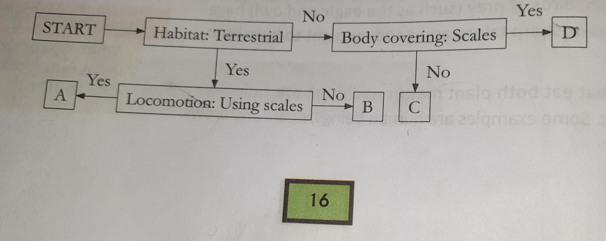

class: inverse, center, middle

# Chapter 2: Animal Adaptations

---

# To Sum Up

- Animal that live in a particular habitat share common adaptations. 
- Body covering like fur, feather, scales and shells prorect animal. 
- Noses, blowholds, lungs, gills and spiracles are some of the breathing organs found in animals. 
- Animals move using legs, muscles, scales, webbed feet, fins, slippers or wings. 
- Animals travel long distance for warmth and food and to have young ones. 
- Animals have different body parts suited to their feeding habits. 

---

# Test Your Learning

- **A. Choose the correct answer**
  1. Which of the followings doesn't have fur on its body?
  
      a. yak
      b. ship
      c. mountain goat
      d. **fish**

  2. The polar bear and the Arctic fox have white fur during winter. Which of the following is the white color of the fur useful for? 
  
      a. to attact attention
      
      b. help them find other of their kind
      
      c. to keep them warm
                                                                                              
      d. **to help them hide in the snow**

  3. Which of the following groups has animals that do not breathe in the same way
  
      a. cockroach, ant, butterfly
      
      b. **shark, tadpole, dolphin**
      
      c. dog, horse, goat
      
      d. parrot, crow, eagle
      
  
---


  4. Which of the following pairs has animals that move in the same way? 
  
      a. shark and lizard
      
      b. ** zebra and horse**
      
      c. crow and caterpillar
      
      d. bear and snake
      
      
  5. Which of the following animals migrates for water? 
  
      a. whale
      
      b. rindeer
      
      c. siberian crane
      
      d. wild beast


---

B. Study the flow chart. Give examples of animals A, B, C, D.

```{r}

```

Examples of Animals A: 


Examples of Animals B: 


Examples of Animal C: 


Examples of Animal D: 


      
  
---

C. Study the diagram and answer the following questions. 

  1. Where would you probably find animal A ? 
  
  Answer: 
  
  2. What are the likely eating habits of animal B ?
  
  Answer: 
  
  3. Give two examples each of animals A and B.
  
  Answer: 
  
  
---

D. Answer the following questions.

  1. What are the types of body coverings that animals have? Give an example of each type. 
  
  2. List two reasons why animals migrate? 
  
  3. Explain the following terms: a. habitat b. spiracle
  
  4. Difference between herbivores, carnivores and omnivores.
  
  5. Describe the type of teeth in herbivores. 
                                                                                             


---

class: inverse, center, middle

# Chapter 3: Food, Health And Hygiene

---
# To Sum Up

- A balanced diet is necessary for good health. 

- Carobhydrates and fats give us enegy while proteins help to repair the worn out tissues
of our bodies. Vitamins and minterals protect us from illness. 

- Roughage and water are important parts of a balanced diet. 
