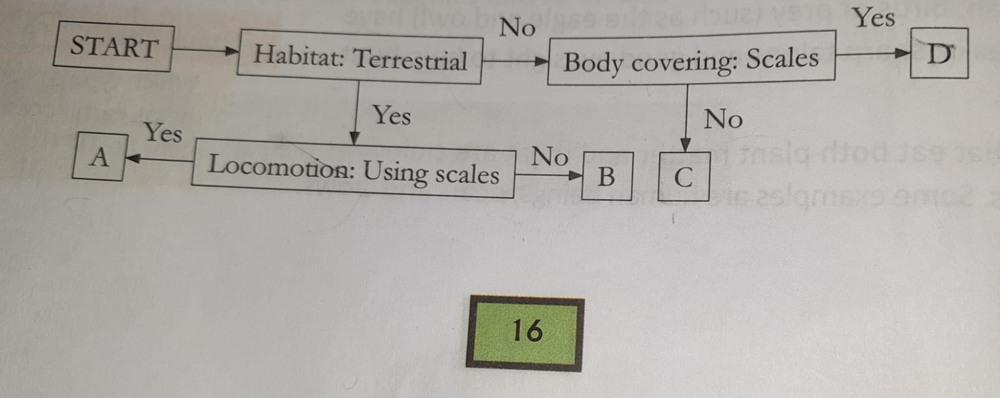
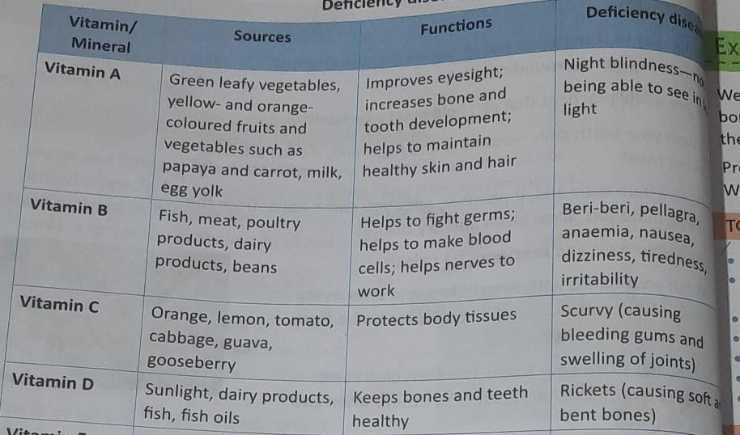
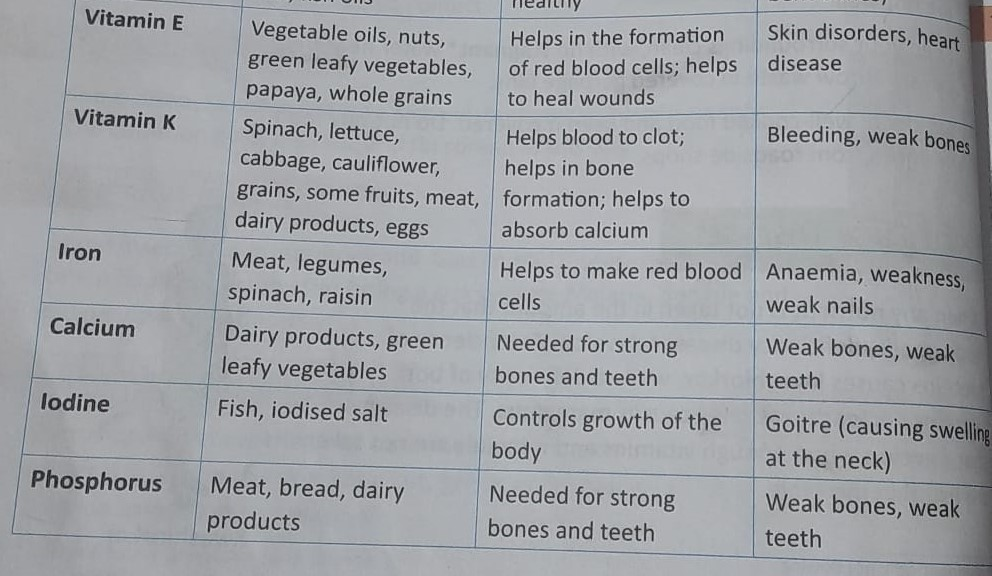

class: inverse, center, middle
```{r include = FALSE}
# https://pkg.garrickadenbuie.com/xaringanthemer/articles/xaringanthemer.html
# install.packages("remotes")
# remotes::install_github("gadenbuie/xaringanthemer")
library(xaringanthemer)


style_duo(primary_color = "#1F4257", secondary_color = "#F97B64", 
        header_font_google = google_font("Josefin Sans"),
  text_font_google   = google_font("Montserrat", "300", "300i"),
  code_font_google   = google_font("Fira Mono")  )

```


# Chapter 2: Animal Adaptations

---
# Matching ggplot Themes

xaringanthemer even provides a [ggplot2] theme with theme_xaringan() that uses the colors and fonts from your slide theme. Built on the showtext package, and designed to work seamlessly with Google Fonts.

Color and fill scales are also provided for matching sequential color scales based on the primary color used in your slides. See ?scale_xaringan for more details.

More details and examples can be found in vignette("ggplot2-themes").

---
```{r , echo=FALSE}
library(ggplot2)
ggplot(diamonds) +
  aes(cut, fill = cut) +
  geom_bar(show.legend = FALSE) +
  labs(
    x = "Cut",
    y = "Count",
    title = "A Fancy diamonds Plot"
  ) +
  theme_xaringan(background_color = "#FFFFFF") +
  scale_xaringan_fill_discrete()
```

---
# To Sum Up

- Animal that live in a particular habitat share common adaptations. 
- Body covering like fur, feather, scales and shells protect animal. 
- Noses, blowholes, lungs, gills and spiracles are some of the breathing organs found in animals. 
- Animals move using legs, muscles, scales, webbed feet, fins, slippers or wings. 
- Animals travel long distance for warmth and food and to have young ones. 
- Animals have different body parts suited to their feeding habits. 

---

# Test Your Learning

- **A. Choose the correct answer**
  1. Which of the followings doesn't have fur on its body?
  
      a. yak
      b. ship
      c. mountain goat
      d. **fish**

  2. The polar bear and the Arctic fox have white fur during winter. Which of the following is the white color of the fur useful for? 
  
      a. to attact attention
      
      b. help them find other of their kind
      
      c. to keep them warm
                                                                                              
      d. **to help them hide in the snow**

  3. Which of the following groups has animals that do not breathe in the same way
  
      a. cockroach, ant, butterfly
      
      b. **shark, tadpole, dolphin**
      
      c. dog, horse, goat
      
      d. parrot, crow, eagle
      
  
---


  4. Which of the following pairs has animals that move in the same way? 
  
      a. shark and lizard
      
      b. ** zebra and horse**
      
      c. crow and caterpillar
      
      d. bear and snake
      
      
  5. Which of the following animals migrates for water? 
  
      a. whale
      
      b. rindeer
      
      c. siberian crane
      
      d. **wildebeest**


---

B. Study the flow chart. Give examples of animals A, B, C, D.

```{r}

```

Examples of Animals A: 


Examples of Animals B: 


Examples of Animal C: 


Examples of Animal D: 


      
  
---

C. Study the diagram and answer the following questions. 

  1. Where would you probably find animal A ? 
  
  Answer: 
  
  2. What are the likely eating habits of animal B ?
  
  Answer: 
  
  3. Give two examples each of animals A and B.
  
  Answer: 
  
  
---

D. Answer the following questions.

  1. What are the types of body coverings that animals have? Give an example of each type. 
  
  The animals have following types of body coverings
  
  - Fur or hai: Animals that live in cold places have fur or hair that help them to keep warm. e.g. 
  sheep, yak and mountain goats are mountain animals that have thick fur. The polar bear and Arctic fox, which live in the Arctic region, also have thick fur. 
  
  - Feathers: The feathers of birds help them fly and also protect them against the dust and cold. 
  
  - Scales: Animals like fish and snakes have scals on their skin to protect themselves. 
  
  - Shell: Animals such as snails, tortoises and turtles have a hard outer shell to protect their soft bodies. 
  
  
  
  2. List two reasons why animals migrate? 
  
  Animals migrate for food and water, they also migrate to go to warmer places to escape winter. 
  
---
  
  3. Explain the following terms: a. habitat b. spiracle
  
  Habitat: The natural surroundings in which an animal lives comfortably is known as its habitat. 
  
  Spiracle: Spiracles are Small holes on the bodies of insect through which they breathe. 
  
  
  4. Difference between herbivores, carnivores and omnivores.
  
  Herbivores: Animals that eat only plants and plant products are called herbivores. e.g. Cow, deer, zebra
  
  Carnivores: Meat eating animals are called carnivores e.g. tiger and wolf, eagle, owl
  
  Omnivores: Animals that each both plant/plant products and meat  are called omnivores. e.g. human beings, bears, crows
  
  5. Describe the type of teeth in herbivores. 
                                                                                             
Herbivores have sharp front teeth and broad back teetch to cut and chew grass. Examples are the cow, deer and zebra. 

---

class: inverse, center, middle

# Chapter 3: Food, Health And Hygiene

---
# To Sum Up

- A balanced diet is necessary for good health. 

- Carbohydrates and fats give us energy while proteins help to repair the worn out tissues
of our bodies. Vitamins and minerals protect us from illness. 

- Roughage and water are important parts of a balanced diet. 

- We must cook and preserve food in such a way that nutrients are not lost. 

- Diseases can either communicable  or non-communicable 

_ Lack of nutrients in the diet causes deficiency diseases. 

- Hygiene and exercise are a must for a healthy lifestyle. 


---
# Test your learning

1. Fr
---

# B. Say wheter the following sentences are true or false. Correct the false statements. 


---


# C. Answer the following questions

What are the types of nutrients present in food? Give two examples of food rich in each type of nutrient. 

Different types of nutrients present in food are-

carbohydrates- They provide energy 
Eg:Rice,wheat, potato

Proteins-they help the body to grow and repair worn out tissues:  milk and dairy products, legumes (dals and beans), poultry products (chicken and eggs)

Fats-to store energy. e.g. oils, meat, dairy products like butter and ghee and cheese, fish, poultry products and nuts. 

Vitamins and minerals protect us from diseases. Our body needs vitamins A, B, C, D, E and K. Iron, calcium, phosphorous and iodine are four important minerals. Vitamins and minerals are found in fresh fruits and vegetable, diary products, eggs and fish. 

2. Why are proteins important? 


---

3. What are the communicable disease ? How do they spread? Give four example of communicable diseases. 

Answer: Communicable diseases also called infectious diseases can spread from one person to another. They can spread in many ways
- through infected food and water
- through direct contact
- through air
- through insects
- through damanged skin

Examples of communicable diseases include cold, flu, measles, malaria, typhoid and tuberculosis. 


4. Discuss four activities you would include in your personal hygiene

 - Brush twice a day
 - Bath ever morning
 - wash your hand with soap before every meal
 - eating clean well cooked healthy food and keeping it covered
 - trim  nails and keep them clean
 - keep my hair clean

5. Explain the function of minerals in the body. What are diseases caused by the deficiency of minerals? 


---
# Deficiency Diseases Chart

```{r}

```


---


```{r}

```


---
class: inverse, center, middle

# Chapter 5: The Nervous System

---
# To Sum Up

- The nervous system controls all the organs in our body. 

- It is made of the brain, the spinal cord and the nerves. 

- The brain is made up of the cerebrum, the cerebellum and the medulla. 

- Nerves carry messages to an from the brain and spinal cord. 

- There are three types of nerves - sensory, motor and mixed. 

- Reflex actions are automatic reactions of our body. The breain is not involved. 

- Our sense organs supply us with information about our surroundings. 


---

# Test Your Learning

## A. Choose the correct answer 

1. The part of the brain that is responsible for learning is the (a. cerebrum). 

2. Information is carried to the brain by (c. sensory organ). 

3. In reflex actions, the (a. brain ) has/have no role. 

4. In dim light, the size of the pupil ( c. decreases ). 

5. Images of objects are formed on the ( c. retina ). 

## B. Fill in the blanks

1. The brain is protected by (the bones of the skull), while the spinal coord is protected by the (vertebral column ). 

2. The ( motor nerves ) carry messages to the muscles. 

3. Reflex actions are controlled by the  (spinal cord ). 

---
## Contd...

4. The (cerebellum ) helps to maintain the balance of the body. 

5. The tongue has (taste buds ) that can sense different tastes. 

## Name the following

1. The largest part of the brain : (cerebrum ) 

2. The other name of a nerve cell : (neurons )

3. The nerves that carry messages from the sense organs to the brain and also from the brain to 
the sense organs: (sensory nerves)

4. The thin structure that moves up and down in the ear: (eardrum)

5. The largest sense organ in the body: (skin)


---

## D. Answer the following questions

1. Name the three organs of the nerves system that control information. 


        i. Sensory Nerves
        
        ii. Motor Nerves
        
        iii. Mixed Nerves


3. What are parts of the brain? Explain their functions. 

The parts of the brains are 

    i. The Cerebrum: It is the thinking part and controls voluntary movement, learning, intelligence and memory. It also helps us to understand the signals that we get from the sense organs. 
  
    ii. The Cerebellum: It is in charge of movement and helps to maintain the balance of the body. 
  
    iii. The Medulla: It controls the heartbeat, breathing, blood circulation, digestion and other involuntary actions like sneezing, swallowing and so on. 

4. Explain the difference between sensory and motor serves. 

Sensory Nerves: These nerves carry messages from the muscles and sense organs to the brain or spinal cord. The brain undestands what the organ has seen, heard, felt, smelt or tasted. 

Motor Nerves: These nerves carry messages from the brian or the spinal cord to the muscles. The brain instructs the muscles on how to act. For example, if your hands are cold, the brain sends a message that makes you put your hands in your pocket. 

5. Explain reflex action with an example. 

When we accidentally touch something hot, we automatically draw our hand back. such actions that we perform without thinking are examples of relex actions. 


6. Draw a neat, labelled diagram of the eye. 

---
class: inverse, center, middle

# Chapter 8: Soil and Its Importance

---
## To Sum UP

- Soil is an important natural resource. 

- It is formed by the weathering of rocks over a long period of time. 

- Soil is very important to both plants and animals. 

- Sand, clay and loam are the basi types of soil found in nature. 

- The soil in any area has three layers: topsoil, subsoil and bedrock or parent rock. 

- Soil erosion takes place when the topsoil is washed away due to natural and human factors. 

- We must conserve soil by using methods like afforestation, terrace farming, contour ploughing and planting shelter belts. 


---

## Test Your Learning

1. Weathering of rocks is _____________

a. the breaking up of rocks into smaller pieces. 

2. The part of the soil that is made of decayed plant and animal material is 

d. humus

3. The type of soil that holds a large amount of water is 

b. loam

4. An activity that leads to soil erosion is 

b. cutting trees

5. Which of the following will stop soil erosion

b. planting more trees and plants


---
## Answer the following questions

1. List the things that social contains.

Answer: Soil contains the following things
        - rocks and minerals
        - dead and broken plants and  animals (make soil fertile. 
          This material is called ***humus***)
        - water and air
        - small worms and insects
        - small organisms like bacteria
        

2. Why is loamy soil used for growing plants? 

Loamy soil is made of sand, silt and clay. Since it holds water and nutrients better than sandy social and drains better than calyey soil, it is often used for growing plans, gardening and agriculture. 


---

3. What are the layers of soil? Explain their properties with a diagram

There are there layers of soil

- Topsoil : It is the topmost layer of soil and has sand and clay. It is rich in humus. It has many nutrients and holds water. It also contains air. 

- Subsoil: this layer contains pieces of rock and is less humus. It has less water and air than top soil. 

- Bedrock : This layer (also called **parent rock**) is mainly made up of large pieces of rock. Bedrock supports the upper layers of the soil. 


---

4. How have humans increased soil erosion? 

Human have increase social erosion by deforestation i.e. cutting down trees, overgrazing by cattle and ploughing of farmlands. 


5. How can soil be conserved

Soil  can be conserved by the following methods

- Afforestation i.e. by planting more trees. 

- Using soil cover by growing grass or covering the land by dry grass.

- Contour ploughing: It is a method of ploughing that follows the curves of the land. This slows the water flowing down and stops the soil from being washed away. 

- Terrace farming : It is practised on the slopes of the mountain. Fields are cut into the sides of mountains to look like step. These steps slow the flow of water down the slope, preventing soil erosion. 

- Growing shelter belts: Bushy plants are grown along the edges of fields to stop the wind from blowing away the soil. 

---
class: inverse, center, middle
# Chapter 11: Nature Links
---
## To sum up
- The biosphere is the part of the Earth where there are living things. 

- The ecosystem is made up of group of interacting organisms and their environments. 

- An ecosystem has a biotic and abiotic compoments. 

- Food chains link plants and animals according to their feeding habits. 

- A food chain can be used to trace the flow of energy. 

- Producers provide energy to all living things directly or indirectly. 

- Consumers do not make their own food. 

- All dead plants and animals matter is broken down by decomposers. 

- Two or more food chains link together form a food web. 

---
## Choose the correct answer

1. Which of the following does/do not depend on air? 

a. plants __b. sunlight__ c. animals d. bacteria

2. Identify the group that contains a producer, a consumer and a decomposer

a. grass, rabbit, eagle 
b. papaya plant, caterpillar, bird 
c. sugarcane, lizard, fungus 
d. grain, rat, snake

3. Which of the followings eats both plants and animals

a. rabbit  b. bear  c. eagle  d. deer

---
class: inverse, center, middle
# Chatper 12: Natural Disasters

---
## To Sum Up

- Natural disasters are natural events that cause great damage to life and property. Examples are earthquakes, tsunami, cyclones, floods and droughts. 

- Earthquakes are caused by the sudden movement of plates in the Earth's crust. 

- Tsunamis are caused by earthquakes or volcanic eruptions under the sea. 

- Heavy rains and melting snow cause water from water bodies overflow into nearby land, causing floods. 

- Droughts occur when a region does not get enough rainfall for a long time. 

- The government and each of us should take steps during and after a diaster to lessen its impact. 

---
## A. Choose the correct answer

1. The Earth's crust is made of many pieces called .......

     **a. plates**
     
     b. faults 
     
     c. aftershocks 
     
     d. tsunamis

2. Which of the followings cannot  be caused by an earthquake? 

    a. landslide 
    
    b. tsunami 
    
    c. cyclone 
    
    d. flood


  
---

3. Which of the following is not a name for a storm? 

  a. hurricane
  
  b. typhoon
  
  c. cyclone
  
  d. tsunami
  
4. __________ are built to prevent floods

  a. bunds
  
  b. banks
  
  c. shores
  
  d. bridges
  
5. Which of these should the government do before a disaster? 

a. provide first aid

b. rescue people

c. provide emergency food 

__d. build evacuation centers__

---
## B. Fill in the blanks

    1. The shaking of the Earth after the main earthquake leads to _________
    
    2. A ______ is a result of an earthquake at sea. 
    
    3. In a cyclone, the winds blow around a quiet area called the ______________
    
    4. Floods cause the spread of _______ diseases.
    
    5. When a drought lasts for a long time, it can lead to a shortage of food called a __famine.__

---
## C. Name a safety measure that you must take if the folowing disaster occur. 

      1. earthquake
      
      
      2. tsunami
      
      
      3. cyclone
      
      
      4. floods

---
## D. Answer the following questions

    1. How does an earthquake occur? 
    
    
    
    2. Describe how a tsunami is formed? 
    
    
    
    3. What are the effects of a cyclone? 
    
    
    
    4. How does water get contaminated during natural disasters? 
    
    
    
    5. How does a decrease in water harm living things? 


---
class: inverse, center, middle

# Chapter 13: The Moon and Eclipses


---
# To Sum Up
- The moon is the earth's only natural satellite. 

- The moon's surface is rocky and is covered with crates and mountains. 

- It is either very cold or very hot on the moon. There is no atmosphere on the moon. 

- The moon's gravity is only one sixth of that of the earth. 

- During its revolution around the earth the moon appears to change shape. These changes are called 
phases of moon. 

- Eclipses are caused when the light from the sun is blocked by either the earth or the moon. 

- A solar eclipse occurs when the moon comes between the earth and the sun. 

- A lunar eclipse occurs when the earth comes between the moon the the sun. 

- Satellites are natural or artificial bodies that revolve around the planets. Artificial satellites have been put in the orbit by people for various purposes - communication, remote sensing, weather 

---

forecasting, education and so on. 


## Answer the following questions

1. Describe the surface of the Moon. 

The surface of the moon is rocky and is covered with craters and mountains. 

2. Why is life not possible on the Moon? 

The life is not possible on the moon because it has no atomosphere. It is very hot during the day and very cold at night. 


3. What do you understand by the phases of the Moon? 

During its revolution around the Earth, the Moon appears to change shape. The changes are called the phases of the Moon. 

4. Describe with a neat diagram how a solar eclipse occurs. 

During its revolution around the Earth, the Moon comes between the Earth and the Sun. When the three objects are in a straight line, the shadow of the Moon falls on the Earth and prevents us from seeing the Sun. This is called solar eclipse. This occurs on  a New Moon day. 

---
5. What are the uses of artificial satellites? 

Satellites are used for the purpose of communication, remote sensing, weather forecasting, education and so on. 


```{r}
# usethis::use_github_pages(brach = "main")
```


---
class: inverse, center, middle
Final Exam on 11th March 2022 (Friday)

9am to 1030am 

655 348 5950

Ms. Paroma
paroma.s@srgsomr.org

Excel in Science

---
class: inverse, center, middle
# Chapter 4: Bones and Muscles

---
class: inverse, center, middle
# Chapter 6:  Safety and First Aid

---
class: inverse, center, middle
# Chapter 10: Our Environment

---
class: inverse, center, middle
# Chapter 11: Nature Links


---
class: inverse, center, middle
# Chapter 15: Measurement: Speed and Density
